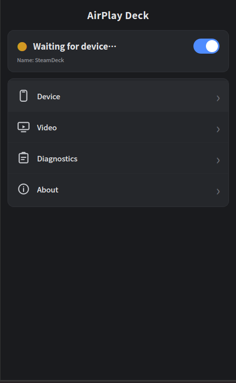
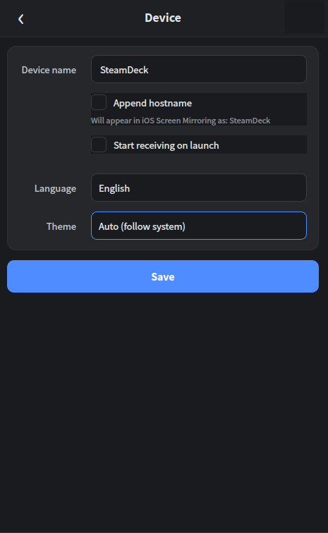
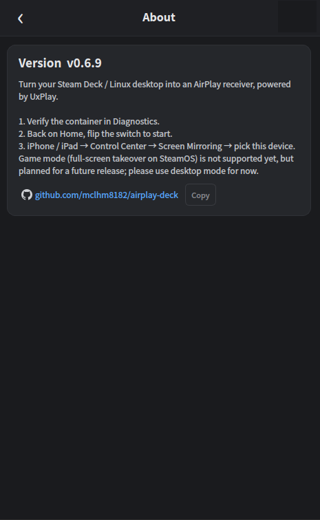

# AirPlay Deck

> 中文版：[README_zh.md](README_zh.md)

Turn your Steam Deck (or any Linux desktop) into an AirPlay receiver, so iPhone and iPad can mirror their screens with one tap.

AirPlay Deck wraps the mature [UxPlay](https://github.com/FDH2/UxPlay) engine (self-compiled 1.73.7). Built with AI assistance, it provides a graphical interface with one-click start and adjustable settings, and works out of the box.

> **Disclaimer:** This is an experimental, AI-assisted hobby project. It is not affiliated with, endorsed by, or sponsored by Apple Inc., and AirPlay is a trademark of Apple. It wraps the third-party [UxPlay](https://github.com/FDH2/UxPlay) engine (GPL-3.0) for personal use. Things may break and features can change, so use it at your own risk. Feedback and contributions are very welcome.

## Features

- One-click mirroring: open the app and connect from the iPhone / iPad Control Center "Screen Mirroring"
- **Desktop Mode** and **SteamOS Game Mode** are both supported. Desktop window mode auto-maximizes portrait cast windows; Game Mode forces fullscreen (`-fs`) and includes X11 auth fixes plus long-session display keepalive (systemd-inhibit + host `xset`).
- The runtime environment (a distrobox container) is compiled and installed automatically on first launch — no manual package setup
- Audio, resolution, frame rate, and display mode are all adjustable
- The GUI is available in 8 languages (Simplified Chinese, Traditional Chinese, English, Japanese, Korean, French, German, Spanish) and follows the system language automatically

## Installation (download and run)

1. Download `AirPlayDeck-x86_64.AppImage` from [Releases](https://github.com/mclhm8182/airplay-deck/releases).
2. Open the file directly after download — no installation needed, it is a single self-contained file.
3. The first launch guides you through a one-click environment setup (about several minutes, requires internet to pull the Ubuntu image and compile UxPlay). After that, just open it each time.

The AppImage lives in your home directory, so SteamOS system updates won't remove it; the runtime container is also in your home directory and persists as well.

## Usage

1. Open AirPlay Deck and click "Start Receiving".
2. Open "Screen Mirroring" in the iPhone / iPad Control Center and pick this device to begin mirroring.
3. The picture shows up as a window; switch back to the app anytime with the taskbar or `Alt+Tab`. You can also set it to fullscreen in Settings. In Desktop **Window / Auto** mode, portrait streams (e.g. iPhone Photos videos) auto-maximize the cast window to fill the screen (needs host `wmctrl` or `xdotool`; Game Mode always forces `-fs`).

**Desktop Mode vs Game Mode**

- **Desktop Mode:** open the AppImage on the desktop as usual.
- **Game Mode:** add the AppImage as a non-Steam game and launch it from SteamOS Game Mode. Casting uses fullscreen. For long videos, keep **Keep screen awake while mirroring** enabled.

**About audio**

Audio sync defaults to "live" mode: sound keeps up instantly when scrolling short videos or gaming, without the few-second delay that appears when content switches. If you watch movies and want strict audio-video alignment, turn on "Audio sync" under "Video & Rendering".

## Screenshots

| Main window | Device & Settings | About |
| --- | --- | --- |
|  |  |  |

## Settings

| Setting | Default | Description |
| --- | --- | --- |
| Video sink | ximagesink | Pure X11 rendering, no OpenGL dependency; most stable under Xwayland / gamescope |
| Frame rate | 30 | Only 30 / 60; arbitrary values can freeze mirroring in some apps |
| Display mode | Window | Window: draggable window, portrait streams auto-maximize to fill; Fullscreen: borderless fill; Auto: same as window on desktop (auto-maximize), forced fullscreen in Game Mode |
| Resolution | Auto | Auto requests a 1280×800 (Deck native) stream, filling the screen without cropping |
| Audio sync | Off | Off: live-style instant audio; On: timestamp-based strict A/V sync (good for movies) |
| Keep screen awake while mirroring | On | Prevents sleep while uxplay runs; Game Mode also uses host `xset` keepalive |
| Run via container | On | Reuses the uxplay-env container, installed automatically on first launch; off requires uxplay installed natively |

## FAQ

**The AppImage does nothing when double-clicked**
Most often it is an in-app error, not a FUSE problem. Run `./AirPlayDeck-x86_64.AppImage` directly in a terminal in desktop mode to see the full error.

**Phone can't find the device**
Usually avahi (mDNS) isn't running. The app waits for avahi on startup; if the device stays undiscoverable for a long time, check the host with `systemctl status avahi-daemon` in a terminal. mDNS inside the container is maintained automatically by the app and rarely needs manual attention.

**Sound but no picture, or picture but no sound**
- No picture: make sure the video sink is ximagesink (the default), and that the app was launched from the desktop environment (double-click the AppImage or use a desktop launcher), not from a headless command-line terminal such as SSH that has no access to a graphical display.
- No sound: SteamOS routes audio through PipeWire; the app automatically connects the container to the host's PulseAudio-compatible interface, usually with no setup. Confirm by searching the log for `音频已接入宿主机 PulseAudio` (host PulseAudio connected).

**Choppy / laggy playback**
Check the log for `raop_rtp resend failed` or `since last client feedback request` together — that indicates Wi-Fi packet loss, not a performance issue. Troubleshoot in order: connect phone and Deck to 5GHz and keep them near the router; turn off router power-saving and the phone's Low Power Mode; keep the video sink as ximagesink; drop frame rate back to 30 if the network is unstable; keep resolution on Auto.

**Environment setup failed**
First try "Install / Rebuild environment" on the "Check & Logs" page. If UxPlay source can't be fetched (common on some networks), download the [v1.73.7 source tarball](https://github.com/FDH2/UxPlay/archive/refs/tags/v1.73.7.tar.gz) from a network that works, save it as `~/uxplay-1.73.7.tar.gz` in your Deck home, then retry — the script prefers the local archive.

**Log shows `no element "ximagesink"`, or it connects but never shows a picture**
The container is missing the `gstreamer1.0-x` package. Run this once to fix it (no need to reinstall the AppImage):
```bash
podman exec -u 0 uxplay-env bash -lc "apt-get update && apt-get install -y gstreamer1.0-x gstreamer1.0-plugins-base gstreamer1.0-plugins-good gstreamer1.0-tools && rm -rf /home/*/.cache/gstreamer-1.0 /root/.cache/gstreamer-1.0 && gst-inspect-1.0 ximagesink"
```

**Game Mode: connects / has sound but no picture, or log shows Authorization required**
SteamOS Game Mode runs Xwayland as the Deck user (uid 1000) while the container may default to root. Recent builds run X probes and uxplay as the host uid/gid and avoid falling back to `unset XAUTHORITY` when a cookie is available. If it still fails, export logs from "Check & Logs" (look for host libX11 probe + container uid) and use Desktop Mode.

**Game Mode: after a few minutes of movie casting the screen goes black while audio continues**
gamescope may blank the display independently of logind. With Keep screen awake enabled, a stronger systemd-inhibit starts as soon as uxplay launches, and a host-side `xset` thread periodically resets the screensaver / forces DPMS on (with a one-shot wake on stop). If `xset` is missing, only inhibit is used and blanking may still occur — install `xset` or fall back to Desktop Mode if it reproduces.

## Building from source (optional)

Prebuilt packages are generated automatically via GitHub Actions, so most users just download. If you need to build it yourself:

- **In a distrobox container on the Deck**: put the repo source into `~/airplay-deck/`, enter an `ubuntu:22.04` container, and run `./build-appimage.sh`.
- **With GitHub Actions**: push the repo to GitHub; pushing `main` triggers a build (artifact in Actions, for verification). Push a `vX.Y.Z` tag to publish a Release.

Building must happen on x86_64 Linux (the AppImage toolchain is Linux-only and cannot natively package on macOS or ARM devices).

## Notes

- This project was built with AI assistance (vibe coding). Both code and docs are open source; issues and PRs are welcome.
- The mirroring engine is based on [UxPlay](https://github.com/FDH2/UxPlay) (GPL-3.0 license) and other open-source projects; credit goes to them.

## License

This program is released under the MIT License. Note: the bundled mirroring engine [UxPlay](https://github.com/FDH2/UxPlay) is GPL-3.0, and runtime dependencies such as PySide6 (LGPL v3) and GStreamer (LGPL) are covered by their own open-source licenses.
